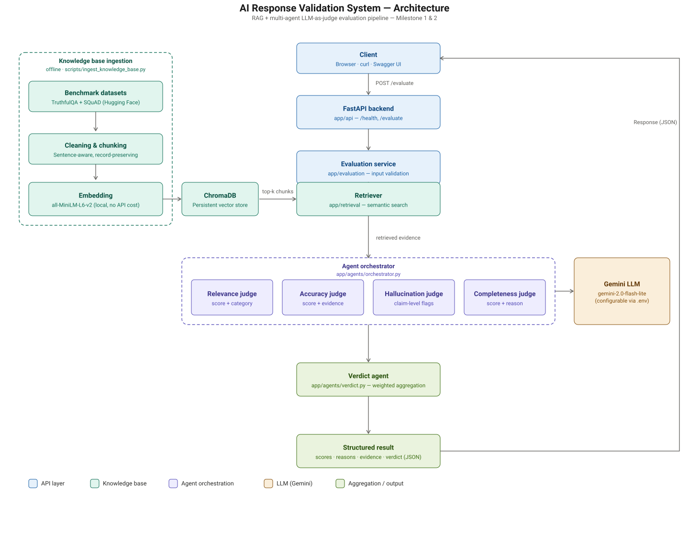

# AI Response Validation System — Hallucination Detection Assistance

**Infosys Springboard Internship Project — Milestone 4**

## Problem Statement
LLM-generated responses can sound confident while containing unsupported or fabricated claims. There's no standard, automated way to check a response's relevance, factual accuracy, faithfulness to source evidence, and completeness.

## Objective
Build a RAG-based, multi-agent evaluation system that scores AI responses against retrieved reference evidence and flags likely hallucinations.

## Current Status

| Item | Status |
|---|---|
| Milestone 1 | **COMPLETE** |
| Milestone 2 | **COMPLETE** |
| Milestone 3 | **COMPLETE** |
| Milestone 4 | **COMPLETE** |
| Automated tests | **142 collected, 140 passed, 2 documented xfail, 0 unexpected failures** |
| M2 validation suite | **22/22 expected outcomes matched** |
| M4.3 end-to-end suite | **87 tests — real orchestrator/agents/store/API/dashboard/PDF pipeline** |
| Two-AI-system demo | **Datasets and steps prepared, not yet executed — see `docs/evaluation/final_demo_plan.md`** |

## Milestones & Progress

### Milestone 1 — Foundation & Knowledge Base — COMPLETE

**M1.1 Research** — Covered LLM evaluation, factuality, relevance, completeness, faithfulness, hallucination detection, RAG architecture, embeddings, semantic similarity, vector search, LLM-as-a-Judge, RAGAS, TruLens, TruthfulQA, and SQuAD. Full notes in [`docs/research/research.md`](docs/research/research.md).

**M1.2 Architecture** — Built the Evaluation Orchestrator coordinating the Relevance Judge, Accuracy Judge, Hallucination Detection Agent, Completeness Judge, and Verdict Agent, with a RAG retrieval flow feeding evidence to each judge. Full breakdown in [`docs/architecture/architecture.md`](docs/architecture/architecture.md).

**M1.3 Evaluation Input Module** — Single FastAPI endpoint accepting a required question and AI response, with optional reference answer and source document, backed by Pydantic input validation.

**M1.4 Reference Knowledge Base** — Ingests TruthfulQA and SQuAD via Hugging Face, with sentence-aware, record-preserving chunking (short Q/A records are kept whole; long contexts split only on sentence boundaries), embedded locally with `all-MiniLM-L6-v2`, and stored in ChromaDB for semantic retrieval. Retrieval quality is verified by an automated test confirming a "capital of France" query surfaces evidence containing "Paris."

**Testing:** 14/14 automated tests passing.

### Milestone 2 — Evaluation Judge Agents & Validation — COMPLETE

**M2.1 Relevance Judge Agent** — Scores relevance with reasoning, using defined categories: `fully_relevant`, `partially_relevant`, `unrelated`, `off_topic` (with explicit criteria distinguishing "same topic, wrong answer" from "no connection at all").

**M2.2 Accuracy Judge Agent** — Scores factual correctness with reasoning and supporting evidence, using defined categories: `correct`, `partially_correct`, `incorrect`, `contradictory`. Compares against the reference answer when available, or retrieved evidence otherwise. Correctly classifies multi-claim responses as `partially_correct` when at least one substantive claim is right, rather than marking the whole response `incorrect`.

**M2.3 Hallucination Detection Agent** — Breaks the response into individual claims and cross-references each against retrieved evidence, returning a `hallucination_status` (`none` / `partial` / `full`) plus a `claim_evidence` list — each flagged claim paired with the contradicting evidence and a reason. Distinguishes genuine unsupported/contradictory claims from responses that are simply irrelevant or off-topic and never attempted to answer the question (these are not treated as hallucinations).

**M2.4 Agent Evaluation & Consistency Validation** — Built a curated validation set of 8 cases spanning correct, incorrect, partially correct, irrelevant, off-topic, incomplete, unsupported-claim, and no-reference/no-evidence response types. Ran through the real agents via [`scripts/run_validation_suite.py`](scripts/run_validation_suite.py) — **22 real LLM evaluation calls, 0 mismatches against expected outcomes**. Automated tests: 14/14 passed.

### Milestone 3 — Completeness, Verdict, Results Display & Batch Evaluation — COMPLETE

Full details in [`docs/evaluation/milestone3.md`](docs/evaluation/milestone3.md).

**M3.1 Completeness Judge Agent** — Extended to break the question into individual sub-requirements and report `addressed_aspects` and `missing_aspects` explicitly, not just a single score.

**M3.2 Verdict Agent & Weighted Evaluation** — Verdict labeling updated to the spec wording (`Pass` / `Needs Improvement` / `Fail`), plus a `consolidated_summary` and `major_issues` list. A hallucination with `hallucination_status = "full"` now forces a Fail verdict regardless of the weighted average, so a fabricated answer can't be masked by good scores elsewhere.

**M3.3 Per-Dimension Scoring & Evaluation Results Display** — Rebuilt the results UI into a full evaluation dashboard: a hero verdict card, a four-metric score overview, a pipeline visualization, a "Why this verdict?" breakdown (strengths/warnings/critical issues), collapsible per-judge detail panels (including claim-level hallucination evidence and completeness aspect lists), an evidence explorer, and a response-vs-evidence comparison — all sourced strictly from existing backend fields.

**M3.4 Batch Evaluation Module** — Upload a CSV of question/response pairs and evaluate all of them through the same Evaluation Orchestrator used for single evaluations. Invalid rows (missing required fields, malformed rows) are reported individually without stopping the rest of the batch. Progress streams as each row actually completes. Results are shown in a table with aggregate statistics (average score per dimension, Pass/Needs Improvement/Fail counts, hallucination frequency), and each row can be inspected using the same detailed view built for M3.3.

**Testing:** 30/30 automated tests passing (17 from Milestones 1–2, plus 13 new tests covering CSV parsing, batch processing, and the batch API endpoint). The batch module was additionally verified manually end-to-end with a mixed valid/invalid CSV.

### Milestone 4 — Dashboard, PDF Export, End-to-End Testing & Final Documentation — COMPLETE

Full details in [`docs/evaluation/milestone4.md`](docs/evaluation/milestone4.md) (technical documentation), [`docs/evaluation/milestone4_testing.md`](docs/evaluation/milestone4_testing.md) (M4.3 test report), and [`docs/evaluation/final_project_report.md`](docs/evaluation/final_project_report.md) (final project report).

**M4.1 Evaluation Scoring Dashboard** — Every single and batch evaluation is now persisted to a SQLite results store ([`app/services/results_store.py`](app/services/results_store.py)). A new Dashboard view (KPI cards, quality-score rings, verdict donut chart, score distribution, hallucination/completeness intelligence, top recurring issues, batch history, filters, paginated records, and drill-down into the existing detailed result view) is generated entirely from that stored data — no chart library added, all visuals are hand-built inline SVG.

**M4.2 Evaluation Report Export** — A structured PDF report per batch ([`app/services/report_generator.py`](app/services/report_generator.py), `GET /reports/batch/{batch_id}/pdf`), built with reportlab's auto-wrapping flowables so long reasoning and evidence never overlap or get cut off, reading from the same store as the dashboard for guaranteed consistency.

**M4.3 End-to-End Testing & System Validation** — An 87-test end-to-end suite ([`tests/test_e2e.py`](tests/test_e2e.py)) runs the real orchestrator, all four agents, the Verdict Agent, the results store, the API, the dashboard endpoints, and the PDF generator together, across 12 representative scenarios and a full batch workflow. Dashboard statistics are checked against both hand-calculated expectations and independent raw SQL queries; PDF content is checked against the live dashboard API for the same batch. This testing pass found and fixed three real defects (a floating-point verdict-threshold boundary issue, a completeness category/score mismatch, and a hallucination status/claims consistency issue), plus caught and fixed a serious regression where the Retriever had reverted to a non-functional placeholder that never queried the vector store at all.

**M4.4 Technical Documentation, Project Report & Final Demonstration** — Complete technical documentation covering every component, a final project report, and a two-AI-system demo plan with prepared, verified-parseable datasets ([`docs/evaluation/demo_datasets/`](docs/evaluation/demo_datasets/)) — the live demo run itself is prepared but not yet executed; see the final project report for details.

**Testing:** 142 automated tests collected (140 passing, 2 documented and intentionally `xfail`ed known limitations).

## Key Features
- Single evaluation submission endpoint (question + AI response, optional reference/source)
- Multi-agent orchestrator: Relevance, Accuracy, Hallucination, Completeness judges + Verdict aggregator — all backed by real LLM scoring (Gemini)
- Reference knowledge base pipeline (TruthfulQA, SQuAD via Hugging Face) → chunk → embed → vector store, with semantic retrieval feeding the judge agents
- Structured, machine-readable JSON evaluation output with per-agent scores, reasons, and unsupported-claims detection
- Retry with exponential backoff for LLM rate limits

## Architecture
```
Client
  ↓
FastAPI (app/api)
  ↓
Evaluation Service (app/evaluation)
  ↓
Retriever (app/retrieval) → Vector Store (app/services/vector_store.py) → ChromaDB
  ↓
Agent Orchestrator (app/agents/orchestrator.py)
  ├── Relevance Judge Agent      → Gemini
  ├── Accuracy Judge Agent       → Gemini
  ├── Hallucination Detection Agent → Gemini
  └── Completeness Judge Agent   → Gemini
  ↓
Verdict Agent → EvaluationResult (JSON)

```




## Agent Responsibilities
| Agent | Purpose | Status |
|---|---|---|
| Relevance | Does the response address the question? | Implemented — LLM-scored |
| Accuracy | Are factual claims correct, checked against retrieved evidence/reference? | Implemented — LLM-scored |
| Hallucination | Are claims supported by evidence? Lists unsupported claims. | Implemented — LLM-scored |
| Completeness | Does the response cover the full question? | Implemented — LLM-scored |
| Verdict | Aggregates weighted scores into overall verdict (PASS/PARTIAL/FAIL) | Implemented |

Each judge agent prompts the LLM for a structured JSON verdict, parses it robustly (handles markdown-fenced output), and fails gracefully with a logged error if the LLM call or parsing fails — a single agent failure doesn't crash the whole evaluation.

## Tech Stack
- **API**: FastAPI + Pydantic
- **LLM**: Gemini (free tier, default) — swappable to Anthropic/OpenAI via `.env`
- **Embeddings**: sentence-transformers (local, no API cost)
- **Vector DB**: ChromaDB (local, persistent)
- **Datasets**: Hugging Face `datasets` (TruthfulQA, SQuAD)
- **Testing**: pytest, with mocked-LLM unit tests for agent logic

## 🎬 Demo


### Interactive API Docs
Once the server is running, explore and test the endpoints live via Swagger UI:
- **Swagger UI:** `http://127.0.0.1:8000/docs`
- **ReDoc:** `http://127.0.0.1:8000/redoc`

### Quick Evaluation Walkthrough

1. Send an evaluation request using `curl` or Postman:

```bash
curl -X POST [http://127.0.0.1:8000/evaluate](http://127.0.0.1:8000/evaluate) \
  -H "Content-Type: application/json" \
  -d '{
    "question": "What is the capital of France?",
    "ai_response": "The capital of France is Berlin, and it has a population of 50 million.",
    "reference_answer": "The capital of France is Paris.",
    "source_document": "France is a country in Europe. Its capital city is Paris."
  }'

## Dataset Sources
See [`data/README.md`](data/README.md) — datasets are not committed, only reproduced via `scripts/ingest_knowledge_base.py`. Currently ingests 817 TruthfulQA records + 2,000 SQuAD records (~5,562 chunks) into the local vector store.

## Project Structure

```project/
├── app/
│   ├── api/            # FastAPI routes (single-eval, batch, dashboard, reports)
│   ├── agents/          # orchestrator, 4 judge agents, verdict agent, prompt utils
│   ├── evaluation/       # input validation, service layer, CSV parser, batch service
│   ├── retrieval/        # retriever (queries vector store)
│   ├── models/          # Pydantic schemas (single-eval, batch)
│   ├── services/         # LLM client (retry/backoff), vector store, results store, PDF report generator
│   ├── static/          # frontend (single evaluation + batch upload + dashboard UI)
│   └── config/          # settings, logging
├── data/               # dataset README (no committed data); evaluation_results.db (git-ignored)
├── scripts/            # ingest_knowledge_base.py, run_validation_suite.py, run_consistency_check.py
├── tests/              # test_api.py, test_agents.py, test_retrieval.py, test_batch.py, test_dashboard.py, test_report.py, test_e2e.py
├── docs/               # architecture / research / evaluation / agile / final report / demo plan
└── main.py             # FastAPI app entrypoint
```

## Installation
```bash
python -m venv venv
venv\Scripts\activate        # Windows
pip install -r requirements.txt
copy .env.example .env       # then fill in your API key
```

## Configuration
Edit `.env` (see `.env.example`):
- `LLM_PROVIDER` — `gemini` (default, free tier), `anthropic`, or `openai`
- `GEMINI_API_KEY` — free key from [Google AI Studio](https://aistudio.google.com/apikey)
- `VECTOR_DB_PATH`, `EMBEDDING_MODEL` — embeddings run locally via sentence-transformers, no API cost

**Cost note:** the default setup (Gemini + local sentence-transformers embeddings + local ChromaDB) needs no paid service to run this project. Gemini's free tier has rate limits; the LLM client retries automatically with backoff.

## Running the Application

1. Build the knowledge base (one-time, or whenever you want to refresh it):
```bash
python scripts/ingest_knowledge_base.py
```
2. Start the API:
```bash
uvicorn main:app --reload
```
Visit `http://127.0.0.1:8000/docs` for interactive API docs.

## Example Evaluation
```bash
curl -X POST http://127.0.0.1:8000/evaluate \
  -H "Content-Type: application/json" \
  -d '{"question": "What is the capital of France?", "ai_response": "The capital of France is Berlin, and it has a population of 50 million.", "reference_answer": "The capital of France is Paris.", "source_document": "France is a country in Europe. Its capital city is Paris."}'
```

Sample response (real Gemini output):
```json
{
  "relevance": {"score": 1, "reason": "The response directly addresses the question..."},
  "accuracy": {"score": 0, "reason": "The AI response incorrectly states that Berlin is the capital..."},
  "hallucination": {
    "score": 0,
    "hallucination_detected": true,
    "unsupported_claims": ["The capital of France is Berlin", "it has a population of 50 million"]
  },
  "completeness": {"score": 1, "reason": "..."},
  "overall_score": 0.25,
  "verdict": "FAIL"
}
```

## Testing
```bash
pytest tests/ -v
```
142 tests collected: API-level input validation (`test_api.py`), agent-level scoring logic (`test_agents.py`), retrieval quality (`test_retrieval.py`), the batch evaluation module (`test_batch.py`), dashboard endpoints (`test_dashboard.py`), PDF report generation (`test_report.py`), and an 87-test end-to-end suite (`test_e2e.py`) that runs the real orchestrator/agents/store/API/dashboard/PDF pipeline together — see [`docs/evaluation/milestone4_testing.md`](docs/evaluation/milestone4_testing.md) for the full methodology and defect list.

For Milestone 2 agent consistency validation against real Gemini calls:
```bash
python scripts/run_validation_suite.py
```
For repeat-run scoring consistency against real Gemini calls (M4.3):
```bash
python scripts/run_consistency_check.py
```

## Limitations
- No caching of LLM calls — repeated evaluations re-query the LLM every time
- Judge prompt quality has been validated against a curated 8-case set (M2.4), not yet benchmarked against large-scale human evaluation
- Batch evaluation processes rows sequentially, not in parallel
- A total LLM outage is currently stored as a genuine Fail verdict rather than flagged as an evaluation error (documented defect D-1)
- A whitespace-only question passes schema validation (documented defect D-5, low severity)

## Future Improvements
- Run and record the two-AI-system demonstration comparison (datasets and steps already prepared — see [`docs/evaluation/final_demo_plan.md`](docs/evaluation/final_demo_plan.md))
- Human-evaluation comparison at larger scale for judge reliability
- Caching layer for repeated evaluations
- Parallelize per-row judge calls to reduce batch latency

## Contributors / Internship Context
Built as part of the Infosys Springboard "AI Response Validation System with Hallucination Detection Assistance" internship project.
